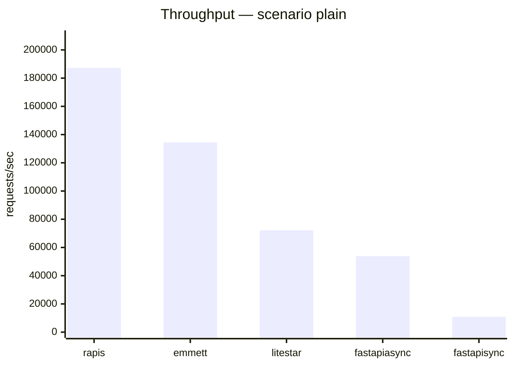
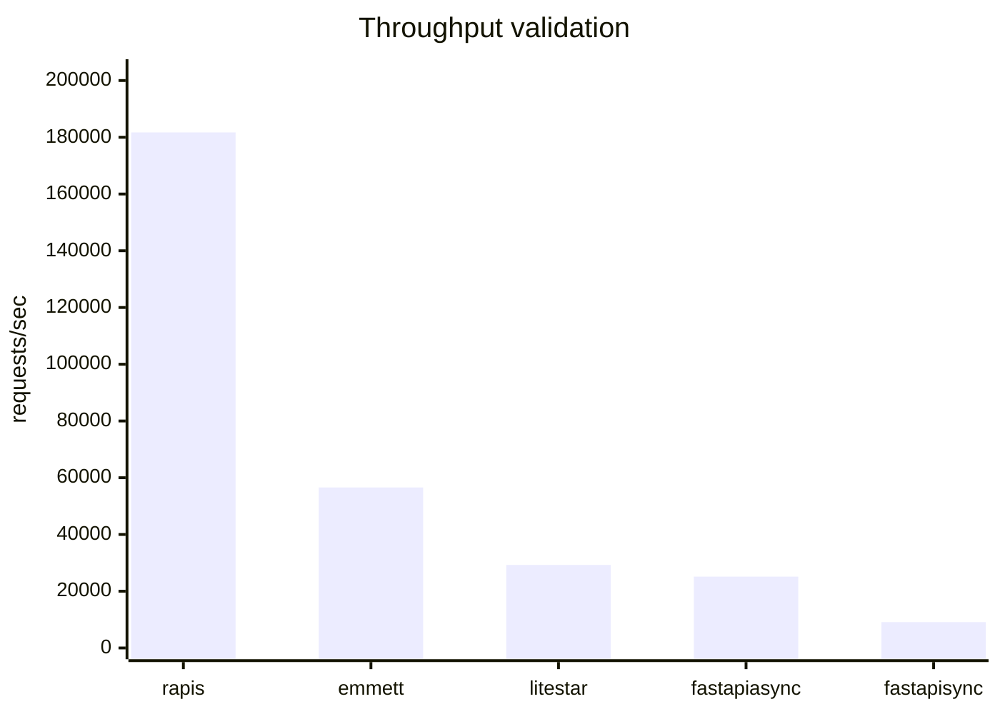
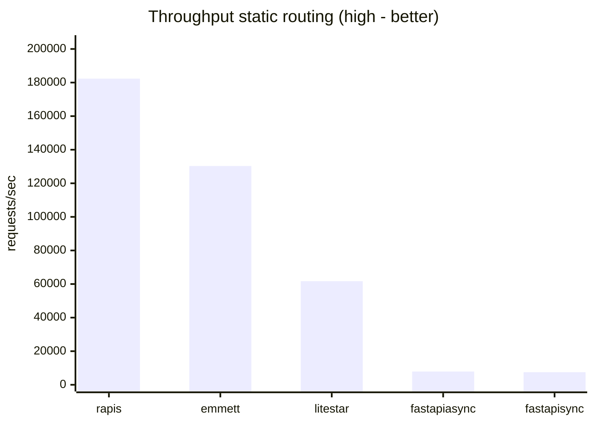
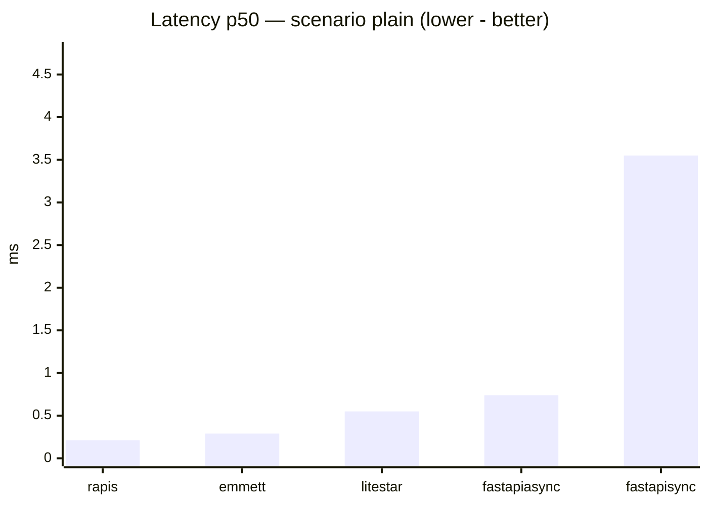
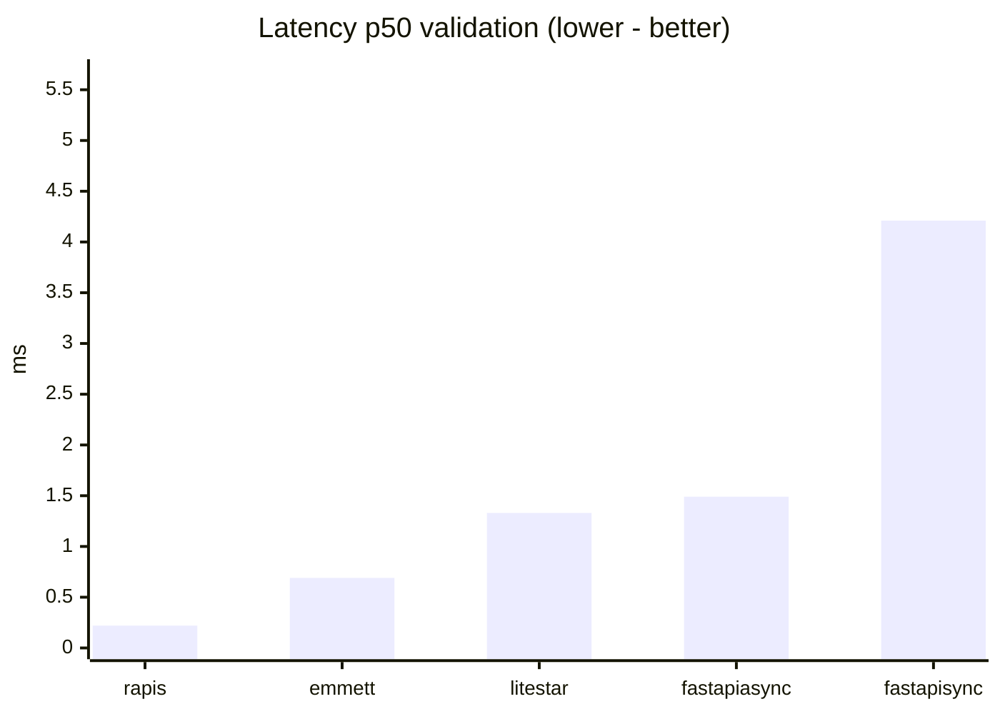
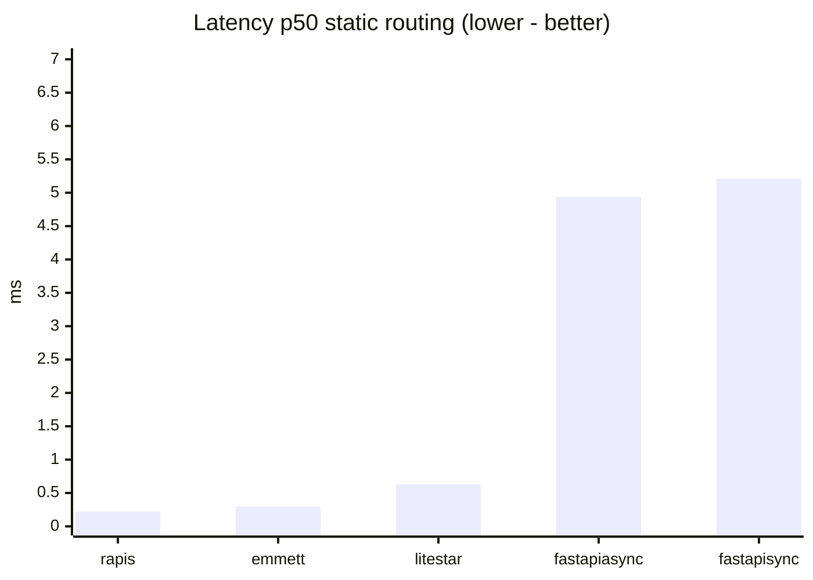

# Benchmarks

_benchmark was partially generated with ai, so framework apps may be not be in their "perfect form" any pull requests for this part of code are welcome_

Micro-benchmarks compare **rapis** with **Litestar**, **FastAPI**, and **Emmett** under the same HTTP server (**Granian**) and load generator (**oha**).

## Methodology

- **Server**: Granian, single worker (`--workers 1`), WebSockets off (`--no-ws`), uvloop(if installed else asyncio) loop.
- **Interfaces**: rapis and Emmett use **RSGI**; Litestar and FastAPI use **ASGI** (Granian supports both).
- **Load**: `oha -z <duration> -c <connections>` against `127.0.0.1` (defaults from `benchmarks/config.py`).
- **Scenarios**
  - **plain**: `GET /bench/plain` → small JSON body (`{"ok":…}`).
  - **validation**: `POST /bench/validate` with JSON payload; rapis validates via **msgspec** `Struct`; Litestar/FastAPI/Emmett via **Pydantic v2**.
  - **static routing**: `GET /bench/r/<index>` with **`BENCH_ROUTE_COUNT` static routes** registered at import time (default **256**); the probe hits the middle route (`TARGET_ROUTE_INDEX = ROUTE_COUNT // 2`).
- Numbers fluctuate with CPU governor, thermal limits, and CI runners — treat results as **ordinal**, not absolute truth.

## Run locally

```bash
pip install -e .
pip install -r benchmarks/requirements.txt
# optional: unset NO_COLOR if your shell sets it (oha parses --no-color strictly)
unset NO_COLOR

export BENCH_DURATION=15s      # optional
export BENCH_CONNECTIONS=40    # optional
export BENCH_ROUTE_COUNT=256    # optional

python benchmarks/run_benchmarks.py
python benchmarks/render_readme.py
```

CI performs the same steps via `.github/workflows/benchmarks.yml` (`workflow_dispatch` or weekly schedule).

---

<!-- BENCHMARK_AUTO_START -->

_Latest automated numbers (see workflow «Benchmarks»)._

#### Environment snapshot

| Setting | Value |
|---------|-------|
| `granian` | granian 2.7.4 |
| `oha` | oha 1.14.0 |
| `duration` | 12s |
| `connections` | 40 |
| `route_count` | 256 |
| routing probe path | `/bench/r/128` |
| interfaces | rapis & Emmett use Granian RSGI; Litestar & FastAPI use Granian ASGI. |

#### Scenario `plain`

| Framework | RPS | avg ms | p50 ms | p99 ms |
|-----------|-----|--------|--------|--------|
| rapis | 187254.03 | 0.2128 | 0.2104 | 0.3202 |
| emmett | 134486.73 | 0.2965 | 0.2943 | 0.3837 |
| litestar | 72182.64 | 0.5535 | 0.5493 | 0.6621 |
| fastapi async | 53855.05 | 0.7421 | 0.7408 | 0.8511 |
| fastapi sync | 10873.86 | 3.6781 | 3.5469 | 9.3178 |

#### Scenario `validation`

| Framework | RPS | avg ms | p50 ms | p99 ms |
|-----------|-----|--------|--------|--------|
| rapis | 181700.05 | 0.2192 | 0.2167 | 0.3275 |
| emmett | 56570.04 | 0.7063 | 0.6882 | 0.8163 |
| litestar | 29265.35 | 1.3661 | 1.3287 | 1.6077 |
| fastapi async | 25143.7 | 1.5902 | 1.491 | 6.6187 |
| fastapi sync | 9103.64 | 4.3935 | 4.2139 | 10.1363 |

#### Scenario `static routing`

| Framework | RPS | avg ms | p50 ms | p99 ms |
|-----------|-----|--------|--------|--------|
| rapis | 182326.84 | 0.2185 | 0.2165 | 0.3209 |
| emmett | 130307.55 | 0.306 | 0.3034 | 0.3994 |
| litestar | 61694.29 | 0.6476 | 0.6341 | 0.8968 |
| fastapi async | 7884.54 | 5.0729 | 4.9351 | 11.0783 |
| fastapi sync | 7499.46 | 5.3332 | 5.2072 | 11.0456 |

### Throughput — scenario plain




### Throughput validation




### Throughput static routing (high - better)




### Latency p50 — scenario plain (lower - better)




### Latency p50 validation (lower - better)




### Latency p50 static routing (lower - better)



<!-- BENCHMARK_AUTO_END -->
---

## Repository layout

| Path | Role |
|------|------|
| `benchmarks/apps/` | Minimal apps per framework (shared routes). |
| `benchmarks/run_benchmarks.py` | Starts Granian + runs **oha**, writes `benchmarks/results.json`. |
| `benchmarks/render_readme.py` | Regenerates Mermaid charts + tables inside this README. |
| `benchmarks/config.py` | Tunables via environment variables. |
