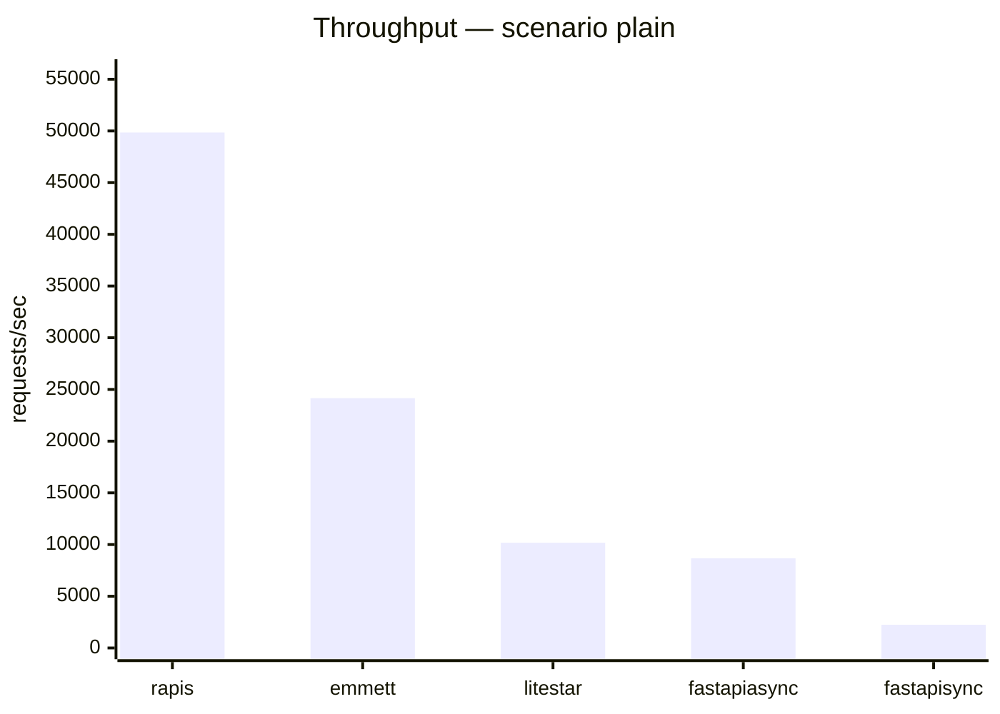
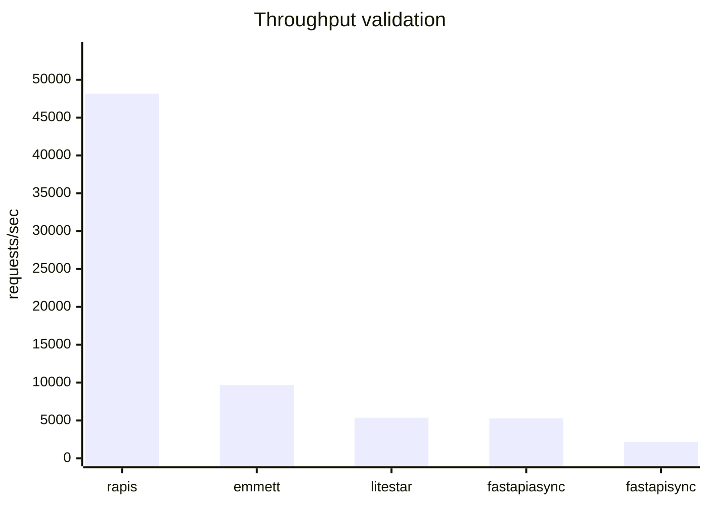
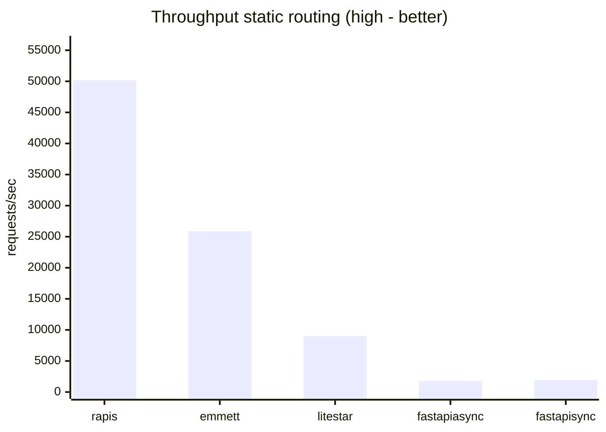
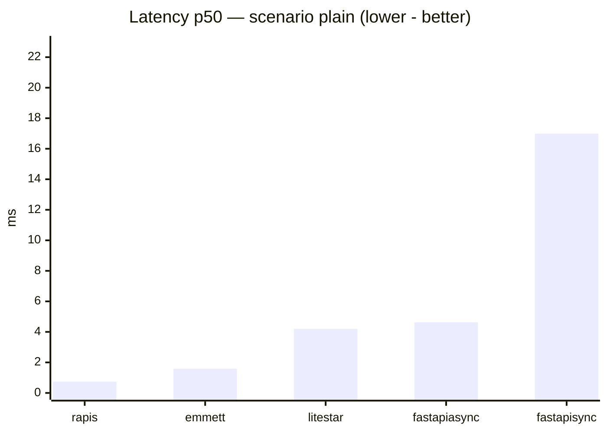
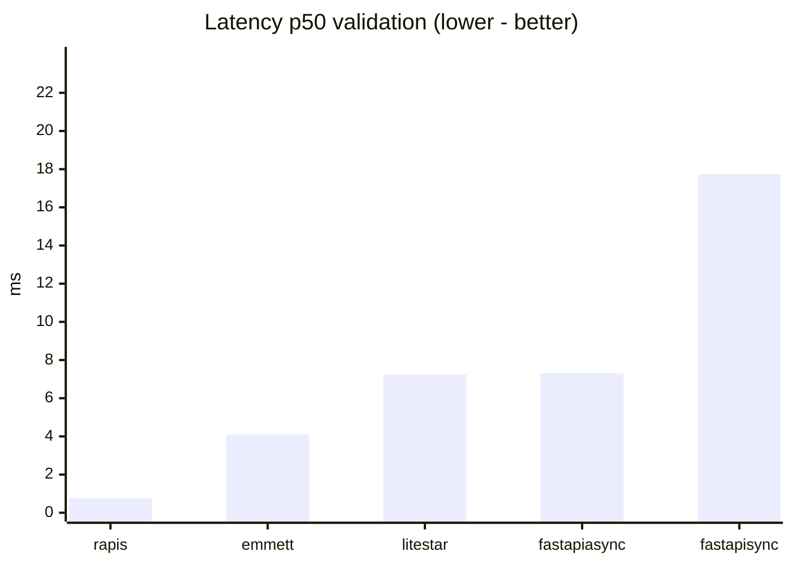
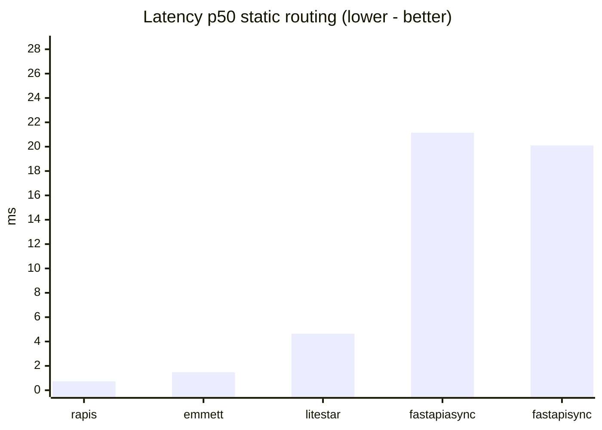

# Benchmarks

_benchmark was partially generated with ai, so framework apps may be not be in their "perfect form" any pull requests for this part of code are welcome_

Micro-benchmarks compare **rapis** with **Litestar**, **FastAPI**, and **Emmett** under the same HTTP server (**Granian**) and load generator (**oha**).

## Methodology

- **Server**: Granian, single worker (`--workers 1`), WebSockets off (`--no-ws`), uvloop(if installed else asyncio) loop.
- **Interfaces**: rapis and Emmett use **RSGI**; Litestar and FastAPI use **ASGI** (Granian supports both).
- **Load**: `oha -z <duration> -c <connections>` against `127.0.0.1` (defaults from `benchmarks/config.py`).
- **Scenarios**
  - **plain**: `GET /bench/plain` → small JSON body (`{"ok":…}`).
  - **validation**: `POST /bench/validate` with JSON payload; rapis validates via **msgspec** `Struct`; Litestar/FastAPI/Emmett via **Pydantic v2**.
  - **static routing**: `GET /bench/r/<index>` with **`BENCH_ROUTE_COUNT` static routes** registered at import time (default **256**); the probe hits the middle route (`TARGET_ROUTE_INDEX = ROUTE_COUNT // 2`).
- Numbers fluctuate with CPU governor, thermal limits, and CI runners — treat results as **ordinal**, not absolute truth.

## Run locally

```bash
pip install -e .
pip install -r benchmarks/requirements.txt
# optional: unset NO_COLOR if your shell sets it (oha parses --no-color strictly)
unset NO_COLOR

export BENCH_DURATION=15s      # optional
export BENCH_CONNECTIONS=40    # optional
export BENCH_ROUTE_COUNT=256    # optional

python benchmarks/run_benchmarks.py
python benchmarks/render_readme.py
```

CI performs the same steps via `.github/workflows/benchmarks.yml` (`workflow_dispatch` or weekly schedule).

---

<!-- BENCHMARK_AUTO_START -->

_Latest automated numbers (see workflow «Benchmarks»)._

#### Environment snapshot

| Setting | Value |
|---------|-------|
| `granian` | granian 2.7.4 |
| `oha` | oha 1.14.0 |
| `duration` | 12s |
| `connections` | 40 |
| `route_count` | 256 |
| routing probe path | `/bench/r/128` |
| interfaces | rapis & Emmett use Granian RSGI; Litestar & FastAPI use Granian ASGI. |

#### Scenario `plain`

| Framework | RPS | avg ms | p50 ms | p99 ms |
|-----------|-----|--------|--------|--------|
| rapis | 49852.05 | 0.8005 | 0.7386 | 2.069 |
| emmett | 24155.4 | 1.6538 | 1.5898 | 2.0797 |
| litestar | 10177.36 | 3.9277 | 4.2015 | 4.573 |
| fastapi async | 8671.87 | 4.61 | 4.628 | 5.8753 |
| fastapi sync | 2240.64 | 17.8372 | 16.9937 | 41.3329 |

#### Scenario `validation`

| Framework | RPS | avg ms | p50 ms | p99 ms |
|-----------|-----|--------|--------|--------|
| rapis | 48153.87 | 0.8287 | 0.7523 | 2.1721 |
| emmett | 9673.29 | 4.1327 | 4.0906 | 4.8734 |
| litestar | 5375.83 | 7.4391 | 7.2371 | 10.0304 |
| fastapi async | 5272.19 | 7.585 | 7.3112 | 25.1194 |
| fastapi sync | 2181.77 | 18.3414 | 17.7312 | 38.4545 |

#### Scenario `static routing`

| Framework | RPS | avg ms | p50 ms | p99 ms |
|-----------|-----|--------|--------|--------|
| rapis | 50190.56 | 0.7951 | 0.7305 | 2.1422 |
| emmett | 25883.43 | 1.5432 | 1.4839 | 1.9683 |
| litestar | 8999.82 | 4.442 | 4.6417 | 5.2884 |
| fastapi async | 1820.45 | 21.9861 | 21.1515 | 45.2601 |
| fastapi sync | 1931.43 | 20.7067 | 20.0968 | 36.5863 |

### Throughput — scenario plain




### Throughput validation




### Throughput static routing (high - better)




### Latency p50 — scenario plain (lower - better)




### Latency p50 validation (lower - better)




### Latency p50 static routing (lower - better)



<!-- BENCHMARK_AUTO_END -->
---

## Repository layout

| Path | Role |
|------|------|
| `benchmarks/apps/` | Minimal apps per framework (shared routes). |
| `benchmarks/run_benchmarks.py` | Starts Granian + runs **oha**, writes `benchmarks/results.json`. |
| `benchmarks/render_readme.py` | Regenerates Mermaid charts + tables inside this README. |
| `benchmarks/config.py` | Tunables via environment variables. |
